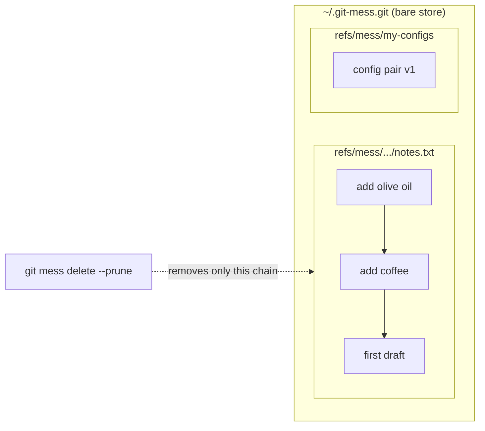

# git-mess

Version files without the ceremony of a git repository — no working tree, no staging area, no branches, no need to decide up front what belongs together. Create a *mess* wherever you have files worth keeping history for: one per directory, as many as you like, each fully independent. And when you're done with a file, delete its entire history in one command, without rewriting anything.

> *"We've got a mess here."*

A mess is a hidden bare object store (`.git-mess.git`, created by `git mess init`) in which each tracked file — or named set of files — gets its own independent history as a ref under `refs/mess/`. Commands run anywhere under that directory find the store automatically, git-style. There's also an optional global mess (`~/.git-mess.git`) that catches files not covered by any local one. Because histories are plain refs — not branches — they are invisible to normal git workflows, and deleting one is just deleting a ref: no `rebase`, no `filter-branch`, no history rewriting.

## Installation

`git-mess` is a Go program whose only runtime dependency is `git` itself — every object operation shells out to git plumbing, nothing is reimplemented.

```bash
go install github.com/jrlangford/git-mess/cmd/git-mess@latest
```

This puts a `git-mess` binary in `$(go env GOPATH)/bin` (usually `~/go/bin`); with that directory on your `PATH`, git automatically exposes it as `git mess`. From a checkout, `go install ./cmd/git-mess` does the same, and `go test ./...` runs the test suite.

Then make your first mess:

```bash
cd ~/wherever
git mess init
git mess snapshot something.txt
```

Snapshotting outside any local mess falls back to the global store (`~/.git-mess.git`), which is created automatically on first use. See [Multiple stores](#multiple-stores) for how store resolution works.

## Multiple stores

Any directory tree can be its own independent mess, and you're encouraged to make several — one per pile of related files. The global store exists as a catch-all for strays. `git mess` resolves which store a command targets the same way git finds a repository — with these precedence rules:

1. `$GIT_MESS_STORE`, if set — an explicit store path that overrides everything.
2. The nearest `.git-mess.git` directory, walking up from the current directory.
3. The global `~/.git-mess.git`.

`git mess store` prints which store won, and `git mess init` creates a local one:

```bash
cd ~/projects/scratch
git mess init                  # creates ./.git-mess.git
git mess snapshot notes.txt    # recorded here, not in the global store
```

From anywhere under that directory, all commands use the local store automatically; sibling directories and everywhere else keep using the global one. Local stores are fully independent — separate histories, separate deletion, separate gc — and everything in this document (push/pull included) works the same, since a local store is just another bare repository. Delete a directory's entire mess by deleting its `.git-mess.git`.

Names and recorded paths in a local store are **relative to the store's root** (the directory holding `.git-mess.git`) — `git mess list` in the example above shows `notes.txt`, not an absolute path. This makes a local mess *relocatable*: move or copy the whole directory, or [clone it](#cloning-a-mess), and every history still lines up with its files. The global store is the exception — it roots at `/` and records absolute paths, since its files can live anywhere.

`git mess init` in a directory that's inside a regular git repository warns but proceeds — the two coexist fine, though you should add `.git-mess.git/` to the repo's `.gitignore` and avoid snapshotting files the repo already tracks (two version histories for one file helps no one).

`GIT_MESS_STORE` remains useful for scripts or for pointing a command at some other store ad hoc:

```bash
GIT_MESS_STORE=/backups/mess.git git mess list
```

## Usage

```
git mess init [<dir>]
git mess store
git mess clone <url> [<dir>]
git mess snapshot <file>... [-n <name>] [-m <message>] [-f]
git mess list
git mess status [<name>...]
git mess log <name>
git mess show <name> [<rev>] [<path>]
git mess diff <name> [<rev1> [<rev2>]]
git mess restore <name>|--all [<rev>]
git mess move <old-name> <new-name>
git mess delete <name> [--prune]
git mess push <remote> [<name>]
git mess pull <remote> [<name>]
git mess hub-init <path>
```

A `<name>` identifies one history. When you snapshot a single file without `-n`, the name defaults to the file's path — relative to the store root for local stores, absolute for the global store — so you can refer to the history by the file path itself. A `<rev>` is any git revision expression — most commonly a short SHA copied from `git mess log`.

### snapshot — record a new version

```bash
git mess snapshot notes.txt                        # name defaults to the file's path
git mess snapshot notes.txt -m "added coffee"      # with a commit message
git mess snapshot a.ini b.ini -n my-configs        # multi-file set (requires -n)
```

Each snapshot becomes a commit chained to the previous one. If the content hasn't changed since the last snapshot, nothing is recorded:

```
git-mess: no changes since last snapshot of notes.txt
```

Executable permission bits are preserved. Multi-file sets snapshot all files together as one version — they share a single history and are restored together.

A file already tracked by *another* history in the same store is refused, since double tracking means two silently diverging version chains for the same path:

```
git-mess: a.txt is already tracked by mess 'bundle'; add -f to force double tracking in this mess
```

Add `-f` if you really mean it — but know that `restore` and `move` on either history will then fight over the same file.

To record everything at once — the mess equivalent of `git commit -a` — use `--all`:

```bash
$ git mess snapshot --all -m "end of day"
notes.txt -> 1ee6c43
my-configs -> 26e6bb5
scratch.py  (clean)
```

Every history with unsnapshotted changes gets a new version from what's on disk; clean ones are left alone. A history whose files are *all* missing from disk is skipped with a warning rather than recorded as emptied — deleting is `git mess delete`'s job, not `snapshot --all`'s.

### list — see all histories

```bash
$ git mess list
Users/jrobin/Documents/notes.txt  [c01a4d1]  2 minutes ago
my-configs                        [a5ef631]  10 seconds ago
```

Pass a remote to list what *it* has — a directory listing of the remote's names, without fetching anything:

```bash
$ git mess list <hub>
shared.txt  [a8d9cb6]
old.txt     (deleted)
```

Names whose deletion has propagated to the remote show `(deleted)`; a name with both a live tip and a not-yet-applied tombstone shows `(tombstone pending)`.

### status — disk vs. last snapshot

```bash
$ git mess status              # all histories; or name specific ones
docs/notes.txt  (clean)
my-configs
  modified  /Users/jrobin/Documents/config.ini
  missing   /Users/jrobin/Documents/flags.ini
```

Compares each history's latest snapshot against what's on disk right now: `modified` means the file's content differs, `missing` means it's gone from its recorded path (deleted — or moved; see `move`). Clean histories are listed on one line. Like `git status`, it changes nothing — run it before `snapshot` to see what a new version would capture, or before `restore` to see what you'd overwrite.

### untracked — files no history covers

The other half of `git status`: `status` reports drift in what *is* tracked; `untracked` finds what isn't:

```bash
$ git mess untracked
/home/you/scratch/stray.txt
```

It scans a directory tree — by default the store root for a local mess, or the current directory for the global one (whose root, `/`, would be absurd to scan) — and lists files not present in any history's latest version. Pass a directory to scan somewhere else. Subtrees owned by *another* mess (containing their own `.git-mess.git`) and `.git` directories are skipped: those files are someone else's jurisdiction. Note that files tracked by a regular git repository still count as untracked here — the mess doesn't know or care what git tracks.

Pipe it into `snapshot` to adopt strays: `git mess untracked | xargs -I{} git mess snapshot {}`.

Performance: the scan is a single `find` streamed through a single `awk` set-lookup, so cost is dominated by walking the directory tree itself, not by how many files or histories there are. For a huge tree, bound the scan by passing a subdirectory. (Files with embedded newlines in their names will confuse the line-based matching — don't do that to yourself.)

### log — see a history's versions

```bash
$ git mess log notes.txt
c01a4d1  2026-07-22 13:29:25  Jonathan Langford  add olive oil
00c1d0b  2026-07-22 13:29:25  Jonathan Langford  add coffee
5a326c0  2026-07-22 13:29:11  Jonathan Langford  first draft
```

Every version records who made it, using git's standard identity rules — see [Authorship](#authorship).

### show — print file content at a version

```bash
git mess show notes.txt              # latest version
git mess show notes.txt 5a326c0      # a specific version
```

For multi-file histories, name the file you want — a bare filename (or any unique fragment of the path) is enough, and it works with or without a revision:

```bash
git mess show my-configs config.ini              # latest version of one file
git mess show my-configs a5ef631 config.ini      # that file at a specific version
```

Omit the path and `git mess show` lists the available files.

### diff — compare versions

```bash
git mess diff notes.txt                      # the most recent change
git mess diff notes.txt 5a326c0              # a version vs. latest
git mess diff notes.txt 5a326c0 00c1d0b      # any two versions
```

Renames are detected across versions (`rename from/to` with a similarity score). If a history has only one version, `diff` shows it as all additions against nothing.

To see **unsnapshotted edits** — what's on disk versus what the history has — add `--disk` (`-d`), the mess equivalent of plain `git diff`:

```bash
git mess diff notes.txt --disk               # disk vs. latest snapshot
git mess diff notes.txt 5a326c0 --disk       # disk vs. an older version
```

An empty diff means the disk matches (what `status` calls clean); a file missing from its recorded path shows as deleted. `--disk` is read-only — it never records anything.

Omit the name to diff the **whole mess** — every history, one `=== name ===` section per history with changes:

```bash
git mess diff --disk        # all unsnapshotted edits across the mess
git mess diff               # every history's most recent recorded change
```

`diff --disk` (nothing to snapshot?) and `snapshot --all` (record it all) are natural companions: review, then commit.

### restore — write files back to disk

```bash
git mess restore notes.txt               # restore latest snapshot
git mess restore notes.txt 5a326c0       # restore an older version
git mess restore --all                   # restore every history's latest version
```

Files are written back to the absolute paths they were snapshotted from, overwriting what's there. Restoring an old version and then snapshotting records the revert as a new version — history is never rewritten, so you can always get back.

### move — rename a history (and its file)

`move` renames a history — and if the history is a single file still sitting at its named path, it moves the actual file too and records the rename as a new version, so disk and history stay in step:

```bash
$ git mess move draft.txt docs/final.txt
moved file: /home/you/draft.txt -> docs/final.txt
moved: draft.txt -> docs/final.txt
```

After this, `log` shows the full chain plus a `move:` entry, `status` is clean, and `diff` reports the rename (`rename from/to` with a similarity score) rather than a delete plus an add.

If you already moved the file yourself, `move` skips the filesystem step — pass the old name exactly as `git mess list` prints it, then `snapshot` from the new path to record it. Multi-file and `-n`-named histories only ever have their *label* renamed; files stay put. `mv` works as an alias.

### delete — drop a history

```bash
git mess delete notes.txt            # drop the ref; objects linger until gc
git mess delete notes.txt --prune    # drop the ref AND purge objects from disk now
```

Without `--prune`, the history is unreachable but its objects remain in the store until garbage collection (git's default grace period is two weeks). With `--prune`, reflogs are expired and `git gc --prune=now` runs immediately — the content is actually gone from disk. Other histories are unaffected either way.

Deletion also records a [tombstone](#deletion-tombstones) so that peers you sync with delete the history too, instead of resurrecting it back to you on the next pull.

## Authorship

Snapshots are ordinary git commits, so each one carries an author name, email, and timestamp automatically. Identity resolves exactly as in git:

```bash
# default: your global identity (~/.gitconfig user.name / user.email)

# a separate identity for all mess snapshots — set it once on the store:
git --git-dir ~/.git-mess.git config user.name  "Jonathan (mess)"
git --git-dir ~/.git-mess.git config user.email jrobin@example.com

# a one-off identity for a single snapshot:
GIT_AUTHOR_NAME="Robot Cleanup" GIT_AUTHOR_EMAIL=bot@example.com \
    git mess snapshot config.ini -n my-configs -m "rotate secret"
```

`git mess log` shows the author of each version. This matters most for shared stores: if several people (or machines, or cron jobs) push into the same remote store, the author field tells you who made each version. Note this is plain metadata, not authentication — anyone can set any name, just as in git generally (commit signing would be the upgrade path if you ever need proof).

## Collaboration

Several people (or machines) can share a mess through a **hub** — which is *not* a special kind of repository, just an ordinary bare store that everyone pushes to and pulls from, configured to protect shared history:

```bash
$ git mess hub-init /srv/team-mess.git      # or on a server, or a GitHub repo
hub store created: /srv/team-mess.git
  history rewrites: DENIED (fast-forward only — nobody can erase a peer's versions)
  ref deletions:    ALLOWED (tombstoned deletes propagate; run gc there to purge)
```

The two config lines are `receive.denyNonFastForwards=true` and `receive.denyDeletes=false`. Note these are independent switches: **fast-forward-only does not prevent deletion.** Rewriting a ref (pointing it at a non-descendant) and deleting a ref are separate operations in git, so the hub can refuse rewrites while still letting a tombstoned deletion land — and content is truly purged from the hub whenever a gc runs there.

The daily workflow is two commands:

```bash
git mess push <hub>            # publish local snapshots, tombstones, deletions
git mess fetch <hub>           # download remote state + preview; changes nothing
git mess pull <hub>            # fetch; fast-forward or 3-way merge each history
```

`fetch` is the look-before-you-leap step: it downloads the remote's refs into a local staging namespace (`refs/mess-fetched/`) and prints, per history, exactly what `pull` would do — `remote ahead (pull will fast-forward)`, `diverged (pull will merge)`, `deleted on remote (pull will delete locally)`, and so on — without moving a single local ref or file. The preview can't lie: it runs the very same classification code `pull` acts on. The fetched copy also persists in your store, so you hold the remote's chains locally (inspectable with plain git against `refs/mess-fetched/*`) even before deciding to pull.

`pull` handles each history independently:

- **New on the remote** → adopted and restored to disk (unless a differing local file is in the way — then the ref is adopted but your file is left alone).
- **Remote ahead** → fast-forwarded, files updated.
- **Local ahead** → left alone; `push` publishes it.
- **Diverged** (you both snapshotted) → a **3-way merge**: the common ancestor comes from `git merge-base`, and each file is merged with `git merge-file`. Non-overlapping edits combine cleanly into a merge version with both chains as parents. Overlapping edits produce standard conflict markers, which are **written to the file and recorded**, loudly flagged — edit the file and `snapshot` to resolve. (Recording the conflicted state keeps everyone's graphs converged, so a half-resolved state can never fork the team; the tradeoff is that markers exist in history until resolved.)
- Histories with **unsnapshotted local changes are skipped** untouched — snapshot or restore first, then pull again.

`push` refuses cleanly when someone beat you to it (the hub rejects the non-fast-forward) and tells you to pull-merge first — the exact loop git users know.

### Deletion tombstones

Distributed deletion has a resurrection problem: if you delete a history and later pull from a peer who still has it, it would come back looking like new data. So `delete` leaves a **tombstone** — a tiny marker under `refs/mess-tombstones/<name>` recording that (and when) the deletion happened. Crucially, the tombstone commit is *not* parented on the deleted chain, so it keeps nothing alive: `--prune` still purges every version.

Sync then works on a **newest-event-wins** rule, comparing the tombstone's timestamp with snapshot timestamps:

- Your `push` deletes the history on the remote and publishes the tombstone.
- A peer's `pull` sees the tombstone, deletes their local history (their working file is left on disk), and keeps the tombstone.
- If someone snapshotted *after* the deletion, their version is newer than the tombstone — it wins, and the history revives everywhere as it propagates.
- Snapshotting a tombstoned name locally revives it explicitly (the tombstone is removed, and your push revives it for everyone).
- `move` tombstones the **old name** for the same reason — otherwise a synced rename would resurrect and duplicate the history under its old name on every peer. The chain itself is untouched: it lives on in full under the new name.

Tombstones are invisible to `list` and cost a few hundred bytes each. Remember the retention caveats from [What the remote keeps](#what-the-remote-keeps--and-what-it-doesnt) still apply: deletion propagates the *intent* everywhere, but each store's content is only physically gone after its own gc.

## Pushing and pulling (plumbing)

Under the hood, `push`/`pull` are ordinary git transfers of the `refs/mess/*` and `refs/mess-tombstones/*` namespaces — a mess history is just a chain of commits under a ref, so it moves to and from any git repository: another bare store, a machine over SSH, or a hosted remote. Everything below works directly against the store if you ever need manual control.

The key property: **mess histories never move unless you name them explicitly.** A default `git push` only considers branches, and the store has none — so a mess can't leak into a push by accident. Transferring one always requires spelling out the `refs/mess/` refspec.

### Push

```bash
# one history
git --git-dir ~/.git-mess.git push <remote> 'refs/mess/<name>:refs/mess/<name>'

# every history at once
git --git-dir ~/.git-mess.git push <remote> 'refs/mess/*:refs/mess/*'
```

`<remote>` is anything git accepts: a path to another bare repo, `user@host:path`, or a URL. For a remote you sync with often, register it in the store once and use its shortname:

```bash
git --git-dir ~/.git-mess.git remote add backup user@host:mess-backup.git
git --git-dir ~/.git-mess.git push backup 'refs/mess/*:refs/mess/*'
```

### Pull

Fetching into a store (e.g. on a second machine) is the mirror image — after which `git mess` works against the copy as usual:

```bash
git --git-dir ~/.git-mess.git fetch <remote> 'refs/mess/*:refs/mess/*'
git mess list
```

To overwrite local histories with the remote's version (e.g. restoring after a lost store), add `--force`. Note there is no merge step here: if both sides snapshotted the same history independently, a plain fetch refuses the non-fast-forward and a forced one discards the local chain — for divergent histories, fetch the remote's version under a different name (`'refs/mess/<name>:refs/mess/<name>-theirs'`) and reconcile by hand.

### Cloning a mess

`git mess clone` copies a remote mess and materializes its files — the mess equivalent of `git clone` giving you a working tree:

```bash
$ git mess clone user@host:projA-mess.git projA
restored .../projA/notes.txt @ 7e78364
restored .../projA/deep/d.txt @ 188e981
cloned 2 histories into projA
```

It creates `<dir>/.git-mess.git`, fetches all `refs/mess/*`, and restores every history's latest version into the directory. Because local-store paths are root-relative, everything lands in the right place regardless of where the clone lives. The result is a normal local mess: `snapshot`, `restore --all`, and pushing back all work immediately. This is most useful for messes made from local stores; cloning a *global* store's histories works too, but their absolute recorded paths mean `restore` targets the original locations, not the clone directory.

### Deleting from a remote

`git mess delete --prune` only purges *your* store. A remote that received the history keeps it until you delete the ref there too — and truly purging its objects requires a gc on that machine:

```bash
git --git-dir ~/.git-mess.git push <remote> ':refs/mess/<name>'   # delete remote ref
# then, on the remote machine:
git --git-dir path/to/store.git gc --prune=now
```

Think before pushing a mess anywhere: doing so publishes its **entire history**, including old versions you may have forgotten, to a place your local delete can't reach.

### What the remote keeps — and what it doesn't

> **Warning: once a ref stops pointing at a commit chain on the remote, that chain's fate is out of your hands. Do not rely on it being recoverable — and do not rely on it being gone.**

What you can and cannot expect from a remote:

- **Ordinary pushes keep everything.** Each push fast-forwards the remote ref, and every older version is an ancestor of the new tip — still reachable, still recoverable. As long as you only ever `snapshot` and `push`, the remote retains the complete history.
- **Recording a deletion is not a purge.** Removing a file from a set (or reverting content) and snapshotting creates a *new version*; the old content remains in the history's earlier commits, on your machine and on every remote you push to. If you pushed a secret once, pushing a version without it does not retract it.
- **Deleting a remote ref (or force-pushing over one) orphans the old chain — with undefined timing.** The commits become unreachable on the remote and survive only until that machine's garbage collection runs. When that happens is not yours to control — a server you don't administer (or a hosting service) runs gc on its own schedule. Concretely:
  - **Never treat the remote as a backup for a history whose remote ref you've deleted or force-replaced.** It may be recoverable for two weeks, or gone in an hour. If you might want it back, fetch it somewhere safe *before* touching the remote ref.
  - **Never assume deleting the remote ref purged the content.** Until a gc actually runs there, anyone with access to the remote can still read the orphaned objects by SHA. For real purging you need `gc --prune=now` on the remote itself — impossible to verify on infrastructure you don't control.

## How it works

Everything is standard git plumbing against a bare store:

1. `git hash-object -w` writes each file's content as a blob.
2. A throwaway index plus `git write-tree` builds a tree (this is what lets nested paths and multi-file sets work).
3. `git commit-tree` creates a commit, parented on the history's previous commit if one exists.
4. `git update-ref refs/mess/<name>` advances the history's ref.

Each history is an isolated chain of commits under its own ref — there is no shared trunk, no `HEAD`, no working tree, and no branches:



Deleting a history deletes one ref, making its commit chain unreachable; pruning then physically removes those objects. Since no branch ever pointed at these commits, nothing needs rewriting.

## Caveats

- **Deleted ≠ purged, unless you `--prune`.** A plain `delete` leaves unreachable objects on disk until garbage collection. Use `--prune` when you want content gone now.
- **Objects are content-addressed and shared.** If two histories contain byte-identical content, they share blobs. Pruning removes only objects that no remaining history references — correct, but worth knowing if you're reasoning about what's physically on disk.
- **Hidden from workflows, not from inspection.** These refs don't appear in branch listings and aren't pushed or fetched by default, but `git --git-dir ~/.git-mess.git for-each-ref` (or `log --all`) will show them. This is organization, not encryption — don't rely on it to conceal secrets from anyone with access to the store.
- **Name sanitization.** Characters that are invalid in ref names (spaces, `~`, `^`, `:`, `?`, `*`, `[`, `\`) are replaced with `-` when deriving a history name from a file path. Two paths differing only in those characters would collide — use `-n` to disambiguate.
- **Restore trusts recorded paths.** Files are restored to the paths they were snapshotted from (root-relative in local stores, absolute in the global one). Restoring a pre-move version recreates the file at its old location — `git mess move` records the rename as a new version, but paths recorded inside old versions are immutable.

## Uninstall

Everything lives in two places: the script itself, and the store. Remove both and `git-mess` never existed:

```bash
rm ~/.local/bin/git-mess
rm -rf ~/.git-mess.git
```
